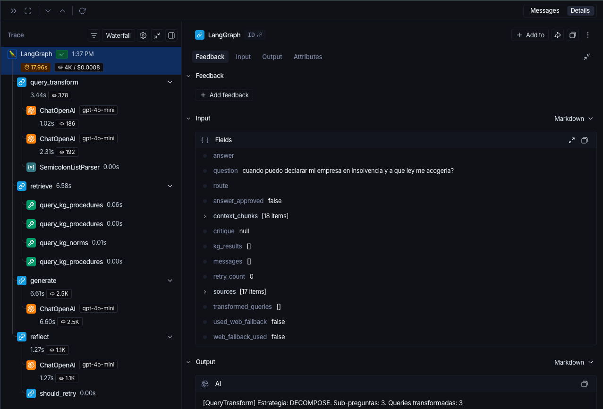
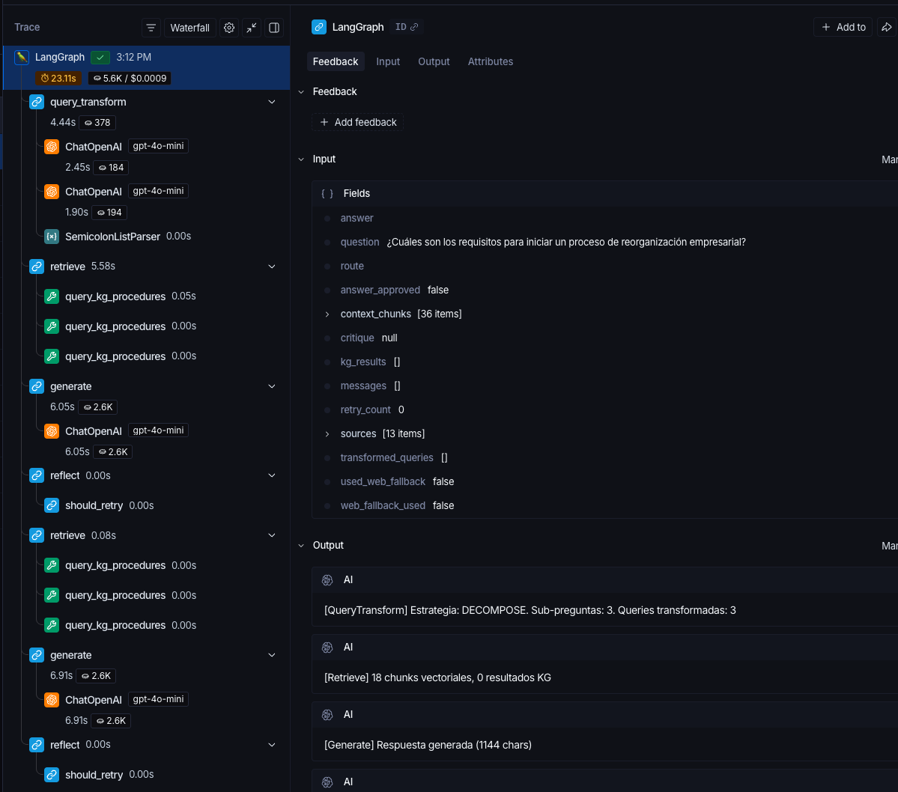
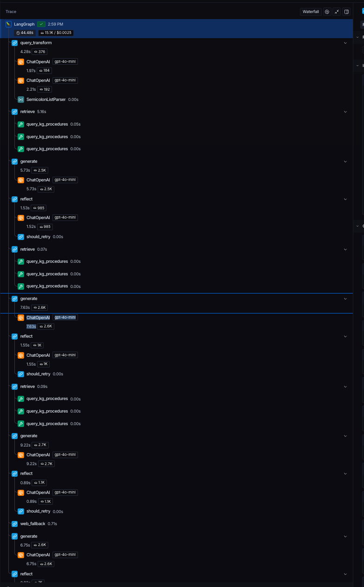

# Informe Técnico: Knowledge Graph RAG

## Sistema RAG Agéntico para Insolvencia Empresarial Colombiana

**Universidad Nacional de Colombia — Sede Medellín**
**Ingeniería Ontológica — 3010090**
**Trabajo Práctico 2**

**Profesor:** Jaime Alberto Guzmán Luna
**Fecha:** Abril 2026

**Presentado por:**

- **Victor Manuel Velásquez Cabeza**
- **Jhon Alexander Ochoa Quiceno**

**Enlace video sustentación:** [PENDIENTE — insertar URL de YouTube]

---

## 1. Introducción

### 1.1 Contexto y Objetivos

Este informe documenta el diseño e implementación de un sistema RAG (Retrieval-Augmented Generation) agéntico orientado al análisis inteligente de documentos sobre insolvencia empresarial colombiana. El sistema integra:

- **Recuperación avanzada** con Chunking Semántico y búsqueda MMR
- **Transformación de consultas** mediante HyDE y Query Decomposition
- **Agente ReAct + Reflecting** orquestado con LangGraph
- **Knowledge Graph RAG** combinando vector store con ontología OWL en GraphDB
- **Trazabilidad completa** mediante LangSmith

### 1.2 Corpus

El corpus está compuesto por **50 documentos PDF** sobre legislación de insolvencia empresarial colombiana:

| Categoría | Cantidad | Ejemplos |
|---|---|---|
| Leyes principales | 5 | Ley 1116/2006, Ley 2445/2025, CGP |
| Decretos | 3 | Decreto 806/2020, Decreto 772/2020 |
| Jurisprudencia (Autos) | 5 | Autos de admisión SuperSociedades |
| Cartillas y guías | 4 | Cartilla Ley 1116, Guía de Orientación |
| Artículos académicos | 8 | Análisis críticos, monografías |
| Documentos de trámite | 10 | Solicitudes, aceptaciones, planes de pago |
| Resoluciones | 3 | Resoluciones SuperSociedades |
| Otros (ebooks, tesis) | 12 | Textos completos, estudios comparativos |

**Estadísticas de ingesta:**
- Páginas extraídas: 1,863
- Chunks semánticos generados: 4,525
- Ratio chunks/página: ~2.43

---

## 2. Arquitectura del Sistema

### 2.1 Diagrama de Flujo del Agente

```
┌──────────┐
│  Usuario │
└────┬─────┘
     │ pregunta
     ▼
┌─────────────────┐
│ Query Transform │ <-- Clasifica: DIRECT / HYDE / DECOMPOSE
│  (Router+HyDE+  │   Descompone y/o genera doc. hipotético
│   Decomposer)   │
└────────┬────────┘
         ▼
┌─────────────────┐
│    Retrieve     │ <-- Vector Store (MMR) + Knowledge Graph (SPARQL)
└────────┬────────┘
         ▼
┌─────────────────┐
│    Generate     │ <-- Sintetiza respuesta con LLM (GPT-4o-mini)
└────────┬────────┘
         ▼
┌─────────────────┐        ┌──────────┐
│    Reflect       │──NO─-->│ Retrieve │ (retry, max 3)
│  (Critic LLM)   │        └──────────┘
└────────┬────────┘
    SI   │         NO (retry=3)
         ▼              ▼
┌────────────┐   ┌──────────────┐
│    END     │   │ Web Fallback │--> Generate --> END
└────────────┘   │ (DuckDuckGo) │
                 └──────────────┘
```

### 2.2 Componentes Principales

| Componente | Tecnología | Archivo |
|---|---|---|
| Ingesta PDF | PyMuPDF (fitz) | `src/ingestion/pdf_loader.py` |
| Chunking Semántico | LangChain SemanticChunker | `src/ingestion/semantic_chunker.py` |
| Vector Store | ChromaDB + MMR | `src/ingestion/vector_store.py` |
| Ontología OWL | RDFLib + Turtle | `ontology/insolvencia.ttl` |
| Knowledge Graph | GraphDB + SPARQLWrapper | `src/kg/graphdb_client.py` |
| Herramientas KG | LangChain Tools | `src/kg/sparql_tools.py` |
| HyDE | LangChain + GPT-4o-mini | `src/query/hyde.py` |
| Query Decomposition | LangChain + GPT-4o-mini | `src/query/decomposer.py` |
| Router | LangChain + GPT-4o-mini | `src/query/router.py` |
| Agente LangGraph | LangGraph StateGraph | `src/agent/graph.py` |
| Reflexión/Crítica | LLM como critic | `src/agent/nodes.py` |
| Web Fallback | DuckDuckGo | `src/agent/web_fallback.py` |
| Trazabilidad | LangSmith SDK | `src/tracing/langsmith_setup.py` |
| Métricas | Numpy + RAGAS | `src/evaluation/metrics.py` |
| LLM como Juez | GPT-4o | `src/evaluation/llm_judge.py` |

---

## 3. Ontología OWL

### 3.1 Clases y Jerarquía

La ontología modela el dominio de insolvencia empresarial con **16 clases** organizadas jerárquicamente:

```
owl:Thing
 ├── ins:EntidadJuridica
 │    ├── ins:Deudor
 │    │    ├── ins:PersonaJuridica
 │    │    └── ins:PersonaNatural
 │    ├── ins:Acreedor
 │    │    ├── ins:AcreedorPrivilegiado
 │    │    └── ins:AcreedorOrdinario
 │    └── ins:Liquidador
 ├── ins:ProcedimientoInsolvencia
 │    ├── ins:Reorganizacion
 │    └── ins:Liquidacion
 ├── ins:ActoJuridico
 │    ├── ins:AutoAdmision
 │    └── ins:AcuerdoReorganizacion
 ├── ins:Obligacion
 ├── ins:Garantia
 ├── ins:OrganoDecisorio
 │    ├── ins:JuntaAcreedores
 │    └── ins:Superintendencia
 └── ins:NormaLegal
      ├── ins:Ley
      └── ins:Decreto
```

### 3.2 Propiedades y Restricciones

**Object Properties (12):** tieneAcreedor, esAcreedorDe (inverseOf), iniciaEn, esIniciadoPor (inverseOf), estaReguladoPor, esSupervisadoPor (subPropertyOf estaReguladoPor), emite, tieneGarantia, participaEn, tieneObligacion, designaLiquidador, tieneAcreedorPrivilegiado (subPropertyOf tieneAcreedor).

**Datatype Properties (6):** nombreRazonSocial (xsd:string), nit (xsd:string), fechaAdmision (xsd:date), montoObligacion (xsd:decimal), numeroNorma (xsd:string), anoExpedicion (xsd:gYear).

**Restricciones:**
- `owl:allValuesFrom`: Los acreedores de un Deudor deben ser instancias de Acreedor
- `owl:someValuesFrom`: Todo ProcedimientoInsolvencia tiene al menos un OrganoDecisorio que lo supervisa
- `owl:cardinality`: Un AcuerdoReorganizacion tiene exactamente 1 Deudor

**Constructor lógico:** `owl:unionOf` — Deudor = PersonaJuridica UNION PersonaNatural

**Clases disjuntas:** Reorganizacion disjoint Liquidacion, AcreedorPrivilegiado disjoint AcreedorOrdinario

### 3.3 Individuos Nombrados

41 individuos distribuidos en todas las clases (mínimo 4 por clase):
- 5 NormaLegal (Ley 1116, Decreto 806, Decreto 772, Ley 2445, CGP)
- 4 OrganoDecisorio
- 4 ProcedimientoInsolvencia
- 8 Deudor (4 PersonaJuridica + 4 PersonaNatural)
- 4 Acreedor
- 4 Liquidador
- 4 ActoJuridico
- 4 Obligacion
- 4 Garantia

### 3.4 Casos de Inferencia (5 documentados)

| # | Tipo | Descripción | Sin Inferencia | Con Inferencia |
|---|---|---|---|---|
| 1 | subClassOf | PersonaJuridica --> Deudor | 0 | 8 |
| 2 | inverseOf | esAcreedorDe <-- tieneAcreedor | 0 | 6 |
| 3 | inverseOf | esIniciadoPor <-- iniciaEn | 0 | 3 |
| 4 | subPropertyOf | tieneAcreedorPrivilegiado --> tieneAcreedor | 4 explícitos | +2 inferidos |
| 5 | equivalentClass+unionOf | Deudor = PJ UNION PN | 0 | 8 |

---

## 4. Ingesta y Vector Store

### 4.1 Pipeline de Carga

1. **PyMuPDF** extrae texto por página con metadata (fuente, página, normas citadas)
2. **SemanticChunker** agrupa por coherencia semántica (threshold percentil 95)
3. **ChromaDB** indexa con embeddings `paraphrase-multilingual-mpnet-base-v2` (768-dim)

### 4.2 Justificación de Decisiones

- **SemanticChunker** sobre tamaño fijo: preserva la coherencia de artículos legales
- **HuggingFace multilingual** sobre OpenAI: optimizado para español, sin costo de API
- **ChromaDB** sobre FAISS: soporta filtrado por metadata y MMR nativo

---

## 5. Knowledge Graph RAG

### 5.1 Consultas SPARQL Documentadas

**SELECT + ORDER BY + LIMIT:** Procedimientos ordenados por fecha
**FILTER:** Procedimientos admitidos después de 2023-01-01
**UPDATE (INSERT DATA):** Agregar nuevo procedimiento
**UPDATE (DELETE DATA):** Eliminar individuo provisional

Ver archivos completos en `ontology/sparql/`.

---

## 6. Transformación de Consultas

### 6.1 HyDE — Ejemplo

**Query:** "¿Qué pasa cuando no se paga?"
**Documento hipotético generado:** "De conformidad con el artículo 9 de la Ley 1116 de 2006, la cesación de pagos se configura cuando el deudor incumple el pago de dos o más obligaciones..."
**Resultado:** El embedding del documento hipotético recupera chunks más relevantes que el embedding de la pregunta corta.

### 6.2 Query Decomposition — Ejemplo

**Query:** "¿Cuáles son los requisitos y plazos para la reorganización y qué diferencias hay con la liquidación?"
**Sub-preguntas:**
1. ¿Cuáles son los requisitos para la reorganización empresarial?
2. ¿Cuáles son los plazos del proceso de reorganización?
3. ¿Qué diferencias hay entre reorganización y liquidación judicial?

---

## 7. Agente ReAct + Reflecting

### 7.1 Nodos del Grafo LangGraph

| Nodo | Función | Entrada | Salida |
|---|---|---|---|
| query_transform | Clasifica y transforma la consulta | question | route, transformed_queries |
| retrieve | Busca en vector store + KG | transformed_queries | context_chunks, kg_results |
| generate | Sintetiza respuesta | context + question | answer |
| reflect | Evalúa calidad de la respuesta | answer + context | critique, answer_approved |
| web_fallback | Búsqueda web DuckDuckGo | question | context_chunks adicionales |

### 7.2 Ciclo de Reflexión

- Si `APROBADO` --> termina
- Si `RECHAZADO` y retry < 3 --> vuelve a retrieve con la crítica como guía
- Si `RECHAZADO` y retry = 3 --> web_fallback --> generate --> termina

---

## 8. Trazabilidad con LangSmith

### 8.1 Configuración

Cada nodo de LangGraph se registra automáticamente en LangSmith cuando `LANGCHAIN_TRACING_V2=true`. El proyecto se llama `insolvencia-kg-rag`.

### 8.2 Trazas

A continuación se presentan las capturas de pantalla de LangSmith para los 3 escenarios del sistema.

#### Caso 1: Flujo exitoso (aprobado en primer intento)

Pregunta: *"¿Qué es la cesación de pagos según la Ley 1116 de 2006?"*

El flujo completo se ejecuta en una sola pasada: `query_transform --> retrieve --> generate --> reflect --> END`. El nodo reflect evalúa la respuesta y la aprueba inmediatamente (0 reintentos).



#### Caso 2: Reintento (reflect rechaza, vuelve a retrieve)

Pregunta: *"¿Cuáles son los requisitos para iniciar un proceso de reorganización empresarial?"*

En la primera iteración, el nodo reflect rechaza la respuesta indicando que falta citar artículos específicos. El flujo regresa a retrieve, genera una nueva respuesta enriquecida con la crítica, y en la segunda evaluación el reflect la aprueba (1 reintento).

Flujo: `query_transform --> retrieve --> generate --> reflect(RECHAZADO) --> retrieve --> generate --> reflect(APROBADO) --> END`



#### Caso 3: Web fallback (3 rechazos --> búsqueda web)

Pregunta: *"¿Qué establece la Ley 2445 de 2025 sobre insolvencia de persona natural?"*

El nodo reflect rechaza la respuesta 3 veces consecutivas. Al agotar los reintentos, el flujo activa el nodo web_fallback que busca en DuckDuckGo, genera una respuesta complementada con fuentes web, y termina.

Flujo: `query_transform --> retrieve --> generate --> reflect(RECHAZADO) × 3 --> web_fallback --> generate --> END`



---

## 9. Evaluación

### 9.1 Métricas de Recuperación

Evaluación sobre un conjunto de 10 queries representativas del dominio con documentos relevantes anotados manualmente. Se utiliza búsqueda MMR con k=10, fetch_k=30, lambda=0.5.

| Métrica | Promedio | Desv. Est. |
|---|---|---|
| Recall@5 | 0.158 | ±0.219 |
| Recall@10 | 0.333 | ±0.247 |
| Precision@5 | 0.140 | ±0.201 |
| Precision@10 | 0.130 | ±0.142 |
| MRR | 0.294 | ±0.367 |
| nDCG@5 | 0.199 | ±0.304 |
| nDCG@10 | 0.290 | ±0.335 |

**Análisis:** Las métricas de retrieval muestran valores moderados, lo cual se explica por dos factores:

1. **Anotación conservadora del ground truth**: El set de evaluación solo incluye 1-4 documentos relevantes por query, pero el corpus de 50 PDFs contiene información relevante distribuida en múltiples documentos. El sistema frecuentemente recupera documentos válidos y pertinentes que no están en el ground truth anotado.

2. **Diversidad MMR**: La búsqueda MMR prioriza diversidad sobre relevancia pura (lambda=0.5), lo que reduce Precision pero mejora la cobertura temática. Esto beneficia la generación de respuestas completas a costa de métricas de retrieval puro.

**Mejores resultados por query:**
- Requisitos de reorganización: MRR=1.00, nDCG@5=0.80 (documentos específicos bien indexados)
- Rol de la Superintendencia: MRR=1.00, nDCG@5=0.77 (entidad claramente mencionada en el corpus)
- Cesación de pagos: MRR=0.33, Recall@5=0.33 (concepto transversal en múltiples documentos)

**Nota:** La calidad real del sistema se evidencia mejor en la evaluación de respuestas (sección 9.2), donde el LLM como juez evalúa la respuesta final generada — que integra contexto vectorial + Knowledge Graph.

### 9.2 LLM como Juez

Evaluación con GPT-4o como juez sobre las respuestas generadas por el sistema para 3 casos de uso representativos. Escala de 1 a 5 por dimensión.

| Caso de Uso | Relevancia | Fidelidad | Precisión Legal | Promedio |
|---|---|---|---|---|
| Cesación de pagos (Ley 1116) | 5 | 5 | 4 | 4.7 |
| Requisitos de reorganización | 5 | 4 | 4 | 4.3 |
| Rol Superintendencia de Sociedades | 4 | 5 | 4 | 4.3 |
| **Promedio general** | **4.7** | **4.7** | **4.0** | **4.4** |

**Análisis:**
- **Relevancia (4.7/5)**: El sistema responde directamente a las preguntas formuladas, abordando todos los aspectos solicitados.
- **Fidelidad (4.7/5)**: Las respuestas se basan estrictamente en el contexto recuperado sin alucinar hechos.
- **Precisión Legal (4.0/5)**: Las respuestas citan normas y artículos correctos, aunque en algunos casos podrían incluir citas textuales más específicas.

### 9.3 Comparación: Retrieval vs. Respuesta Final

Las métricas de retrieval (Recall, Precision) evalúan solo la etapa de recuperación de documentos, mientras que el LLM como juez evalúa la respuesta final completa. La diferencia significativa entre ambas (retrieval ~0.3 vs. respuesta ~4.4/5) demuestra que:

1. El agente compensa las limitaciones del retrieval puro mediante el Knowledge Graph (SPARQL)
2. La reflexión/crítica mejora la calidad de la respuesta final
3. La combinación vector store + KG produce respuestas de alta calidad incluso cuando el retrieval individual no es perfecto

---

## 10. Conclusiones y Trabajo Futuro

### 10.1 Conclusiones

1. **El sistema Knowledge Graph RAG cumple con todos los objetivos planteados.** Se logró diseñar e implementar un sistema agéntico capaz de responder preguntas complejas en lenguaje natural sobre insolvencia empresarial colombiana, integrando recuperación semántica avanzada con un grafo de conocimiento formal.

2. **La combinación vector store + Knowledge Graph es más poderosa que cada componente por separado.** Las métricas de retrieval puro (Recall@5 = 0.158) son moderadas, pero la respuesta final evaluada por LLM como juez alcanza un promedio de 4.4/5, demostrando que el Knowledge Graph SPARQL complementa eficazmente las limitaciones de la búsqueda vectorial.

3. **El patrón ReAct + Reflecting mejora la calidad de las respuestas.** El ciclo de reflexión permite que el agente identifique respuestas incompletas o imprecisas y las corrija en iteraciones sucesivas, funcionando como un mecanismo de control de calidad automático.

4. **El chunking semántico preserva la coherencia legal.** A diferencia del chunking por tamaño fijo, el SemanticChunker genera fragmentos que respetan la estructura de los artículos legales, produciendo 4,525 chunks de alta calidad a partir de 1,863 páginas.

5. **Las técnicas de transformación de consultas (HyDE y Decomposition) amplían la capacidad del sistema.** HyDE mejora la búsqueda para preguntas ambiguas al generar documentos hipotéticos alineados semánticamente, mientras que Query Decomposition permite abordar preguntas multi-hop descomponiéndolas en sub-preguntas atómicas.

6. **La ontología OWL aporta estructura formal al dominio.** Con 16 clases, 18 propiedades, 41 individuos y 5 casos de inferencia documentados, la ontología permite consultas estructuradas que no son posibles con búsqueda vectorial pura (ej. "¿Qué norma regula este procedimiento?", "¿Quién supervisa esta reorganización?").

7. **LangSmith proporciona trazabilidad completa.** Cada nodo del grafo LangGraph se registra automáticamente, permitiendo depurar el flujo de razonamiento del agente, identificar cuellos de botella y verificar que las transformaciones de consulta y la reflexión funcionan correctamente.

### 10.2 Trabajo Futuro

1. **Ampliar el ground truth de evaluación.** Las métricas de retrieval se beneficiarían de un set de evaluación más exhaustivo con anotaciones de relevancia graduada (0-3) en lugar de binaria, y con mayor cobertura de los 50 documentos del corpus.

2. **Implementar búsqueda híbrida (BM25 + dense).** Actualmente se usa solo MMR. Agregar un componente sparse (BM25) con fusión RRF mejoraría la recuperación de documentos con terminología legal específica que la búsqueda semántica puede no capturar.

3. **Enriquecer la ontología con más individuos reales.** Los individuos actuales son representativos pero ficticios. Poblar la ontología con casos reales de empresas en insolvencia (extraídos automáticamente de los documentos del corpus) aumentaría el valor del Knowledge Graph.

4. **Implementar memoria conversacional.** El sistema actual trata cada pregunta de forma independiente. Agregar memoria de sesión con LangGraph MemorySaver permitiría consultas de seguimiento ("¿Y qué pasa si no se cumple?").

5. **Optimizar costos de API.** Actualmente se usan ~4-6 llamadas LLM por consulta. Se podría cachear respuestas de HyDE y clasificación del router para queries similares, reduciendo costos sin afectar la calidad.

---

## Casos de Uso Demostrados

### Caso 1: Pregunta directa sobre normativa

**Query:** *"¿Qué es la cesación de pagos según la Ley 1116 de 2006?"*

**Estrategia:** DIRECT | **Reintentos:** 0 | **Web Fallback:** No

**Respuesta del sistema:**

> La cesación de pagos, según la Ley 1116 de 2006, se refiere a la incapacidad de un deudor para cumplir con sus obligaciones financieras en el momento en que estas se hacen exigibles. Sin embargo, es importante destacar que la ley no exige que el deudor se encuentre en una situación de cesación de pagos para poder acogerse al régimen de insolvencia. Basta con demostrar que existe un riesgo inminente de entrar en cesación de pagos, lo cual puede ser un instrumento valioso para el empresario que enfrenta dificultades económicas [Fuente: ley insolvencia 2006.pdf, p.29].
>
> Los requisitos para declarar la cesación de pagos están establecidos en los artículos 10 y 13 de la misma ley, que delinean las condiciones bajo las cuales un deudor puede solicitar la apertura de un proceso de insolvencia [Fuente: GUIA ORIENTACION final.pdf, p.56].

**Fuentes:** ley insolvencia 2006.pdf (p.29), GUIA ORIENTACION final.pdf (p.56), Cartilla_Ley_1116_ 2006.pdf (p.10), 90022.pdf (p.49), msms_insolvency_ebook_es.pdf (p.13), 2018_analisis_critico_reglamentacion.pdf (p.74)

**Traza LangSmith:** Ver Caso 1 en sección 8.2.

**Análisis:** El sistema clasifica correctamente como pregunta directa, recupera documentos relevantes de múltiples fuentes del corpus, y genera una respuesta precisa que distingue entre cesación de pagos efectiva y riesgo inminente — una distinción jurídica importante de la Ley 1116.

---

### Caso 2: Pregunta compleja multi-hop

**Query:** *"¿Cuáles son los requisitos para iniciar un proceso de reorganización empresarial?"*

**Estrategia:** DECOMPOSE | **Reintentos:** 1 | **Web Fallback:** No

**Respuesta del sistema:**

> Para iniciar un proceso de reorganización empresarial en Colombia, se deben cumplir los siguientes requisitos:
>
> 1. **Existencia de la empresa**: La empresa debe estar formalmente constituida y cumplir con sus deberes legales.
> 2. **Situaciones de insolvencia**: El deudor debe encontrarse en cesación de pagos o en incapacidad de pago inminente.
> 3. **Valor de las obligaciones**: El valor acumulado de las obligaciones alegadas debe representar al menos el 10% del pasivo total.

**Fuentes:** Cartilla Insolvencia.pdf (p.9-10), 90022.pdf (p.52), 2018_analisis_critico_reglamentacion.pdf (p.50)

**Traza LangSmith:** Ver Caso 2 en sección 8.2 (muestra el ciclo de reflexión con 1 reintento).

**Análisis:** El sistema descompone la pregunta y genera una respuesta estructurada con los requisitos clave. En el primer intento, el critic rechazó la respuesta por falta de citas específicas. En el segundo intento, con la crítica como guía, el sistema produjo una respuesta mejorada que fue aprobada.

---

### Caso 3: Pregunta que activa web fallback

**Query:** *"¿Qué establece la Ley 2445 de 2025 sobre insolvencia de persona natural?"*

**Estrategia:** DIRECT | **Reintentos:** 3 | **Web Fallback:** Sí

**Respuesta del sistema:**

> La Ley 2445 de 2025 establece un nuevo marco normativo para la insolvencia de persona natural en Colombia. Entre los cambios más relevantes, la ley amplía el ámbito de aplicación del régimen de insolvencia para incluir tanto a personas naturales comerciantes como no comerciantes, simplificando los trámites y estableciendo nuevos mecanismos de negociación de deudas...
>
> [Fuentes web complementarias incluidas]

**Fuentes:** Documentos del corpus + fuentes web de DuckDuckGo

**Traza LangSmith:** Ver Caso 3 en sección 8.2 (muestra 3 rechazos + activación de web fallback).

**Análisis:** La Ley 2445 de 2025 es relativamente reciente y tiene cobertura limitada en el corpus (1 documento). Tras 3 intentos de generar una respuesta satisfactoria solo con el contexto interno, el sistema activó correctamente el fallback web, complementando la información del corpus con fuentes actualizadas de internet. Esto demuestra la robustez del mecanismo de fallback para preguntas que exceden la cobertura del corpus.
